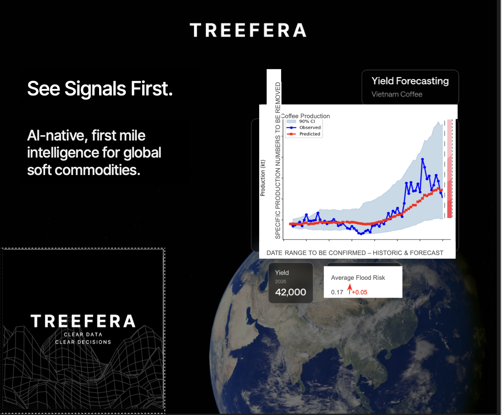

I need to be able to meet this request. So this is the request below.

Fundamentally, what this is about is being able to produce a synthetic data set such that we can have a graph of the time series of a forecast for Vietnamese coffee yield. And so what we want to look at is the yield on the y-axis in kilogram per hectare for Vietnam and time series along the x-axis go from 2020 onwards. So it'd be really good for us to get, do some deep research and do some research into what the kind of example coffee yield is and what can be done with that information. So we need to know context and where we can get data for this that already exists. And if it doesn't exist, like just basically what the numbers are and what the range numbers are and what the big events are in the last five years so that we can include those in our synthetic time series. Also we want to get a sense of what the total like kilogram per hectare yield is for coffee in Vietnam in general.

<request>
Hi Tommy & Dom,Sorry for the late message, but we need some urgent support on a request we have been struggling to get clarity on – and we are now behind on an external deadline. Not sending for immediate action obviously, but would be lovely if you could prioritise in your morning?We’re currently pulling together data visuals for marketing, including a conference booth design. If we don't have this sorted by Thursday 11am, we will miss our opportunity to get the booth printed (big problem!).

For context - this is a huge event for us, Jonathan is speaking & we have a fantastic opportunity to engage with a very senior audience of commodity traders –> we need to nail it and we cannot look like idiots by pasting a misleading / clearly inaccurate visual on our booth!Request: Support on Data Visual for APAC Conference Carmi has very kindly helped us with a couple of options, but we need to provide the design team with a clear, accurate brief on exactly what data we can and should show. Critically, we don't want to look like idiots showing numbers that don't make sense...!

For this booth, we want to show Coffee, Vietnam –> historic & forecasted production, Yield # and Average Flood Risk (see the screen shot below... Carmi, sorry for destroying your beautiful design!

Guidance from Jonathan: Jonathan reviewed the current design and asked that we proceed with the following approach: Use an existing graphic (Ghana cocoa production - included below), but:
- change the product label to Vietnam Coffee
- do not include exact production numbers on the graph
- include a forecast (short term)
- Shorten the timeline
- Use a near-term horizon for the forecast (~3 months forward) Avoid long-range charts 

Honestly I am struggling to know exactly what dates make sense here seeing as the example is from 1950 - 2020... aka historic & long time frame .... 
- Flood risk to be shown as a separate data pointInclude a credible, specific figure (0.17)

SOOOO with that in mind, we now need support on: 
- Confirmation on what numbers & date ranges can we use  (realistic, don't make us look stupid)- Yield Forecast # or % increase?
- Flood Risk # (0.17 was the example JH used so I am happy to stick to that?) 
- Graph –> Date Range (note the production numbers have been removed based on JH feedback) & numbers to show a realistic historic & forecasted result

Please can you support us in getting these questions answered as soon as possible, or looping in the appropriate team member to help? I am sorry for the urgency, but we have gone around quite a few people and just need to be super clear and get a final answer.Thank you

</request>